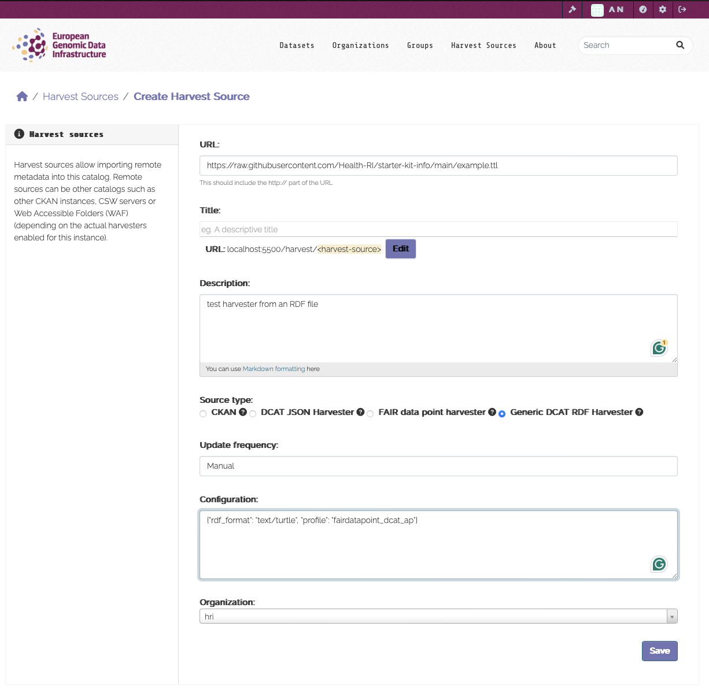

<!--
SPDX-FileCopyrightText: 2024 PNED G.I.E.

SPDX-License-Identifier: CC-BY-4.0
-->

---
title: Test harvesting of DCAT-AP
---

Assuming the CKAN development with is set up as documented in this wiki.

First, modify the `.env` file, add the following to plugins: `dcat_rdf_harvester`, rebuild en restart the containers.

Go to CKAN harvest page (e.g. [http://localhost:5500/harvest](http://localhost:5500/harvest)). Click “Add Harvest Source”

At URL, enter URL of dataset you want to harvest. Example: [https://opendata.swiss/en/dataset/verbreitung-der-steinbockkolonien.xml](https://opendata.swiss/en/dataset/verbreitung-der-steinbockkolonien.xml), fill in the rest then Save.

To test harvesting, in Docker Desktop, go to the container then click Terminal. Enter the command `ckan --config=/srv/app/ckan.ini harvester run-test <id of harvester>`, the <id of harvester> is the part of the URL of the harvest source.

You’ll get some output and hopefully see datasets popping up in CKAN!

## Test CKAN harvesting of DCAT-AP using local mock endpoint 

Go to CKAN harvest page (e.g. [http://localhost:5500/harvest](http://localhost:5500/harvest)). Click “Add Harvest Source”. 

At URL, enter URL of dataset you want to harvest. Example: [http://national_catalogue_mock:8001/xnat.ttl](http://national_catalogue_mock:8001/xnat.ttl), fill in the rest then Save. Execute the command from above within the CKAN docker container. 

