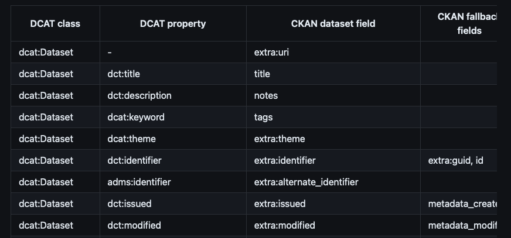

<!--
SPDX-FileCopyrightText: 2024 Stichting Health-RI

SPDX-License-Identifier: CC-BY-4.0
-->

### Dataset tables

every field which extends the core schema lands in extra table.

In demo schema `ckan_ckan_dataplatform_nl` table `package` - columns are core fields of CKAN, and `package_extra` for every other field. Scheming extension of Civity allows more flexibility for managing extra fields than CKAN core default functionality but still such a field is converted to a string and lands in extra table. It is possible to write a mapper to and map all the extra fields. For DCAT there is an official extension:  
[https://github.com/ckan/ckanext-dcat#json-dcat-harvester](https://github.com/ckan/ckanext-dcat#json-dcat-harvester) It is compatible with DCAT-AP v1.1 and 2.1

### Harvester tables

In the DB there are several tables dedicated to store harvester-related information:

* `harvest_source` - harvested sources are defined
* `harvest_object` - the table where all the objects from a source are saved. Data from a source are stored in `harvest_object.content` and from there will be converted to a CKAN dataset.

harverters are also saved to `package` table of `type` harvest.

Once you changed something in the DB directly, you must trigger re-indexing in Solr via search-index rebuild of [CLI](https://docs.ckan.org/en/2.9/maintaining/cli.html).