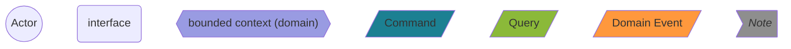
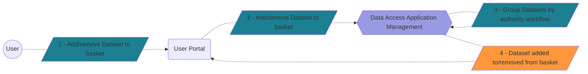
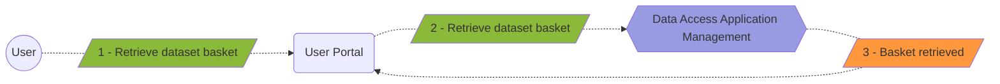
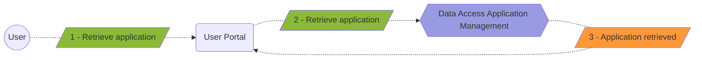
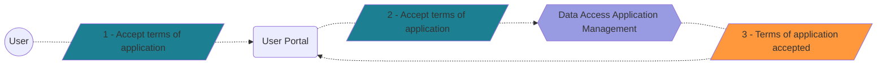
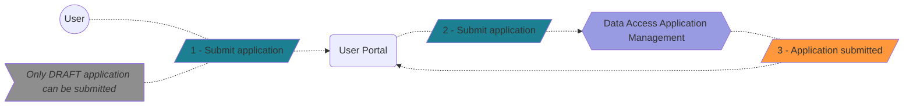
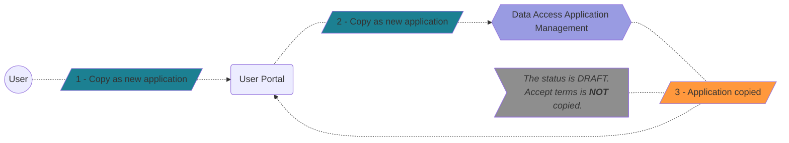

<!--
SPDX-FileCopyrightText: 2024 PNED G.I.E.

SPDX-License-Identifier: CC-BY-4.0
-->

Below you will find all use cases (domain message flows) regarding Data Access Application Management, to be implemented by User Portal.

## Meaning of shapes

## Add dataset to basket

## Retrieve basket

## Create application from basket

## Retrieve application

## Accept terms of application

## Attach file to application

```mermaid
flowchart LR
    user(("`
        User
    `"))
    
    user_portal("`
        User Portal
    `")
    
    daam{{"`
        Data Access Application Management
    `"}}
    style daam fill:#999be2
    
    attach_file_1[/"`
        1 - Attach file to/remove attachment from application
    `"/]
    attach_file_2[/"`
        2 - Attach file to/remove attachment from application
    `"/]
    style attach_file_1 fill:#1C8092
    style attach_file_2 fill:#1C8092

    file_attached[/"`
        3 - File attached to application
    `"/]
    style file_attached fill:#FF983D

    user -.- attach_file_1
    attach_file_1 -.-> user_portal
    user_portal -.- attach_file_2
    attach_file_2 -.-> daam
    daam -.- file_attached
    file_attached -.-> user_portal
```

## Add/remove applicant

```mermaid
flowchart LR
    user(("`
        User
    `"))
    
    user_portal("`
        User Portal
    `")
    
    daam{{"`
        Data Access Application Management
    `"}}
    style daam fill:#999be2
    
    add_applicant_1[/"`
        1 - Add/remove applicant to/from application
    `"/]
    add_applicant_2[/"`
        2 - Add/remove applicant to/from application
    `"/]
    style add_applicant_1 fill:#1C8092
    style add_applicant_2 fill:#1C8092

    applicant_added[/"`
        3 - Applicant added to/removed from application
    `"/]
    style applicant_added fill:#FF983D

    user -.- add_applicant_1
    add_applicant_1 -.-> user_portal
    user_portal -.- add_applicant_2
    add_applicant_2 -.-> daam
    daam -.- applicant_added
    applicant_added -.-> user_portal
```

## Add/remove dataset

## Add/remove DUO

## Save form

## Submit application

## Notify user

```mermaid
flowchart LR
    user(("`
        User
    `"))
    
    email("`
        Email Server
    `")

    dac(("`
        Data
        Access
        Committee
    `"))
    
    dac_portal("`
        DAC Portal
    `")
    
    daam{{"`
        Data Access Application Management
    `"}}
    style daam fill:#999be2
    
    approve_application_1[/"`
        1 - Approve/reject/change application
    `"/]
    
    approve_application_2[/"`
        2 - Approve/reject/change application
    `"/]
    style approve_application_1 fill:#1C8092
    style approve_application_2 fill:#1C8092

    application_approved[/"`
        3 - Application approved/rejected/changed
    `"/]
    style application_approved fill:#FF983D

    notify_user[/"`
        4 - Notify user of changes on application
    `"/]
    style notify_user fill:#1C8092

    dac -.- approve_application_1
    approve_application_1 -.-> dac_portal
    dac_portal -.- approve_application_2
    approve_application_2 -.-> daam
    daam -.- application_approved
    application_approved -.-> dac_portal
    daam -.- notify_user
    notify_user -.-> email
    email -.-> user
```

## Retrieve notifications

## Copy as new application

