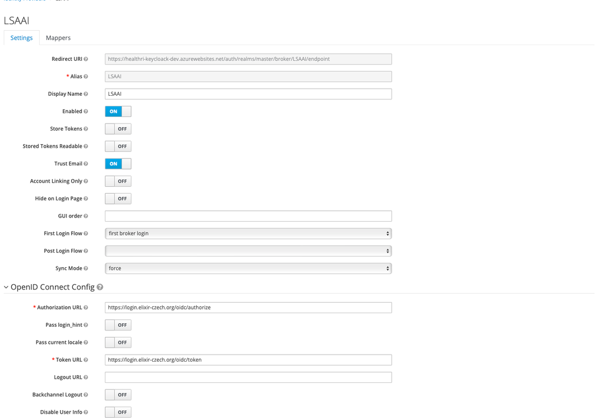

# Configure KeyCloak with Azure and LSAAI

* * *

## Keycloak

For Keycloak, I utilized a Linux app service plan within Azure. One of the primary advantages is that HTTPS is readily configured out of the box, eliminating the need for additional work with certbot. Moreover, when using an app service plan, there's no need to be concerned about Linux updates.

In addition, I followed the tutorial available at the following link to successfully set up Keycloak: [https://www.youtube.com/watch?v=neHFkd8c-gc](https://www.youtube.com/watch?v=neHFkd8c-gc)

## Configuring Identity Providers (IdPs)

When configuring identity providers (IdPs), the following information becomes crucial for OpenID setup:

* ClientSecret
* ClientId
* Token endpoint
* Access endpoint
* Reply URL

Both the token endpoint and access point are derived from the IdP. When registering a service, you acquire the clientId and secret. The reply URL, which remains constant, is provided by Keycloak:  
[https://{app_name_azure}.azurewebsites.net/auth/realms/master/broker/azuread/endpoint](https://{app_name_azure}.azurewebsites.net/auth/realms/master/broker/azuread/endpoint)

Additionally, the corresponding configuration entails:

* Scopes: "openid", "profile", "email"
* Method: POST the Clientsecret
* Sync method: import

#### Azure AD

For Azure integration, I followed the tutorial at [https://www.youtube.com/watch?v=LYF-NLHD2uQ.](https://www.youtube.com/watch?v=LYF-NLHD2uQ.) This tutorial comprehensively explains both the service registration and the Azure AD setup within Keycloak. Management of the app registration is done within our Ad: [portal.zure.com](http://portal.zure.com)

### LSAAI

To register Keycloak as service I used [https://elixir-europe.org/platforms/compute/aai/service-providers.](https://elixir-europe.org/platforms/compute/aai/service-providers.) .  
Initially, obtaining an account is the first step. If your componay isn't inherently recognized as an IdP, I initially registered an account with LSAAI. Subsequently, I proceeded to register our service. Please note that approval for this step may entail a waiting period.  
  
Management of the app registration is done within: [https://services.aai.lifescience-ri.eu](https://services.aai.lifescience-ri.eu) .

Discovery endpoint: [**https://login.elixir-czech.org/oidc/.well-known/openid-configuration**](https://login.elixir-czech.org/oidc/.well-known/openid-configuration)

The LSAAI configuration looks like:  

The first time you logged in. You get a question if you to want to be a member of the test environment. Please proceed

