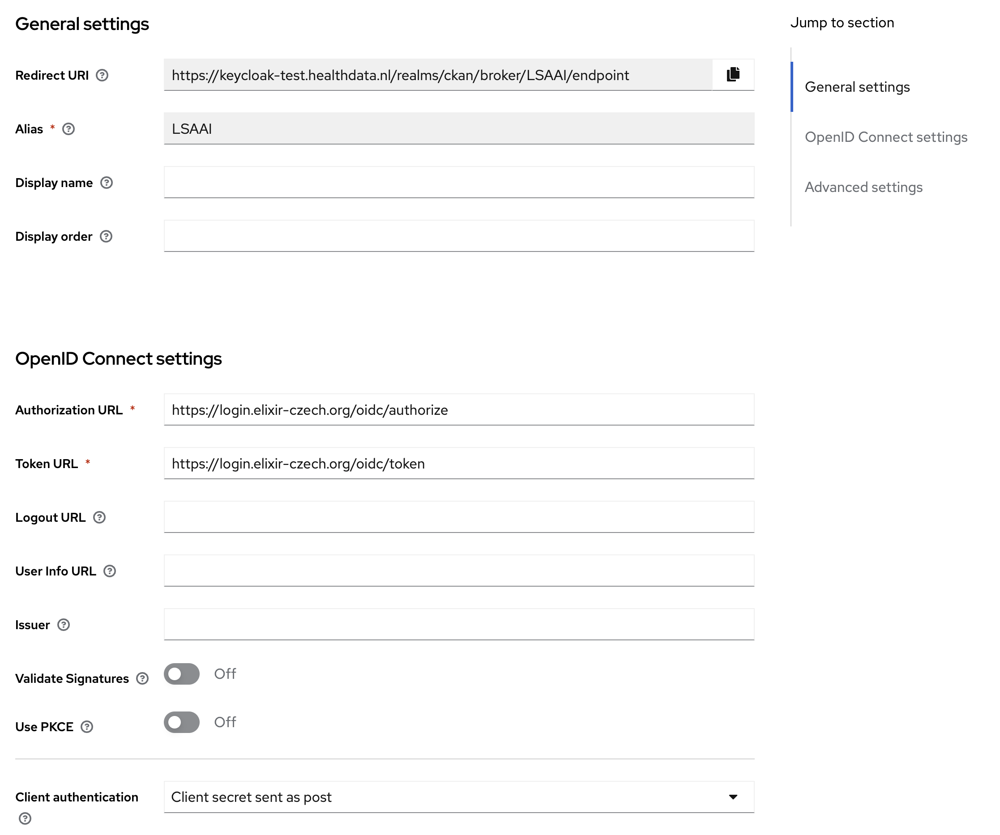
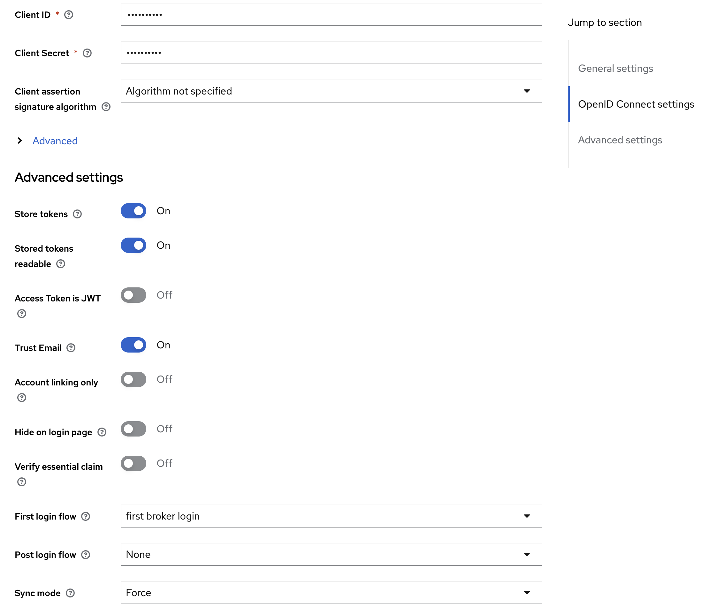

<!--
SPDX-FileCopyrightText: 2024 Stichting Health-RI

SPDX-License-Identifier: CC-BY-4.0
-->
## Keycloak

Keycloak can be obtained by running the CKAN deployment script eg.: [CKAN deployment script Azure](./../deployment/azure/azure_cli_deployment_guide.md)

## Configuring Identity Providers (IdPs)

When configuring identity providers (IdPs), the following information becomes crucial for OpenID setup:

* ClientSecret
* ClientId
* Token URL
* Authorization URL
* Redirect URI

Both the 'Token URL' and 'Authorization URL' are derived from the IdP. When registering a service, you acquire the clientId and secret. The 'Redirect URI', which remains constant, is provided by Keycloak:  
[https://{app_name_azure}.azurewebsites.net/auth/realms/master/broker/azuread/endpoint](https://{app_name_azure}.azurewebsites.net/auth/realms/master/broker/azuread/endpoint)

Additionally, the corresponding configuration entails:

* Scopes: "openid", "profile", "email"
* Method: POST the Clientsecret
* Sync method: import

#### Azure AD

For Azure integration, I followed the tutorial at [https://www.youtube.com/watch?v=LYF-NLHD2uQ.](https://www.youtube.com/watch?v=LYF-NLHD2uQ.) This tutorial comprehensively explains both the service registration and the Azure AD setup within Keycloak. Management of the app registration is done within our Ad: [portal.zure.com](http://portal.zure.com)


### LSAAI

To register Keycloak as service I used [https://elixir-europe.org/platforms/compute/aai/service-providers.](https://elixir-europe.org/platforms/compute/aai/service-providers.) .  
Initially, obtaining an account is the first step. 1. Make sure your organisation is recognised as IdP and register if not. 2. Submit a registration for you application as a service. Please note that approval for this step may entail a waiting period.  
  
Management of the app registration is done within: [https://services.aai.lifescience-ri.eu](https://services.aai.lifescience-ri.eu) .

Discovery endpoint: [**https://login.elixir-czech.org/oidc/.well-known/openid-configuration**](https://login.elixir-czech.org/oidc/.well-known/openid-configuration)

The LSAAI configuration looks like:  



Note 1: Sync mode must be "import" instead of "force"\
Note 2: `Store tokens` and `Stored tokens` must be on, to allow User Portal components to get LS-AAI `access_token`. That enables Beacon Network integration via Oauth2.\

The first time you log in you will get a question if you want to be a member of the test environment. Agree and proceed.

## Fetching LS-AAI Access Token from Keycloak

In order to fetch access token from LS-AAI - or any IdP - one needs to configure Keycloak accordingly, and later request to Keycloak LS-AAI tokens.

1. Go to `Keycloak Admin \ Identity Providers \ LS-AAI Provider Details`;
2. Enable `Store Tokens` and `Stored tokens readable`;
3. Delete LS-AAI existing users, to ensure users are initialised correctly in Keycloak;
4. Login with a LS-AAI user;
5. Call Keycloak endpoint:
```
GET https://keycloak-test.healthdata.nl/realms/ckan/broker/LSAAI/token
Authorization: {keycloak_access_token}
```