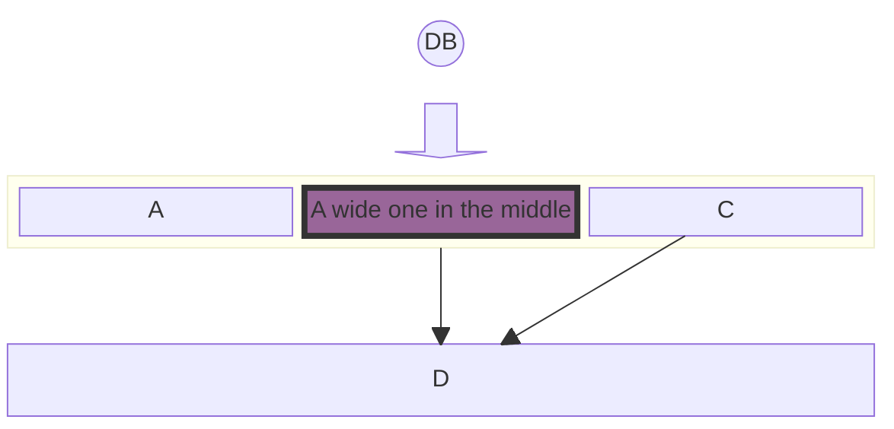
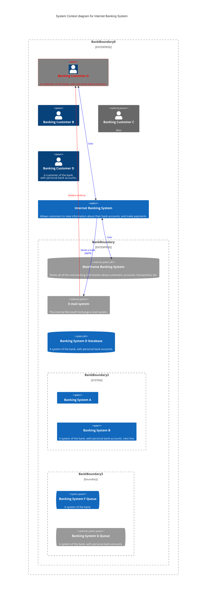

<!--
SPDX-FileCopyrightText: 2024 Stichting Health-RI

SPDX-License-Identifier: CC-BY-4.0
-->
## block



## xychart

```mermaid
xychart-beta
    title "Sales Revenue"
    x-axis [jan, feb, mar, apr, may, jun, jul, aug, sep, oct, nov, dec]
    y-axis "Revenue (in $)" 4000 --> 11000
    bar [5000, 6000, 7500, 8200, 9500, 10500, 11000, 10200, 9200, 8500, 7000, 6000]
    line [5000, 6000, 7500, 8200, 9500, 10500, 11000, 10200, 9200, 8500, 7000, 6000]s
```

## C4


