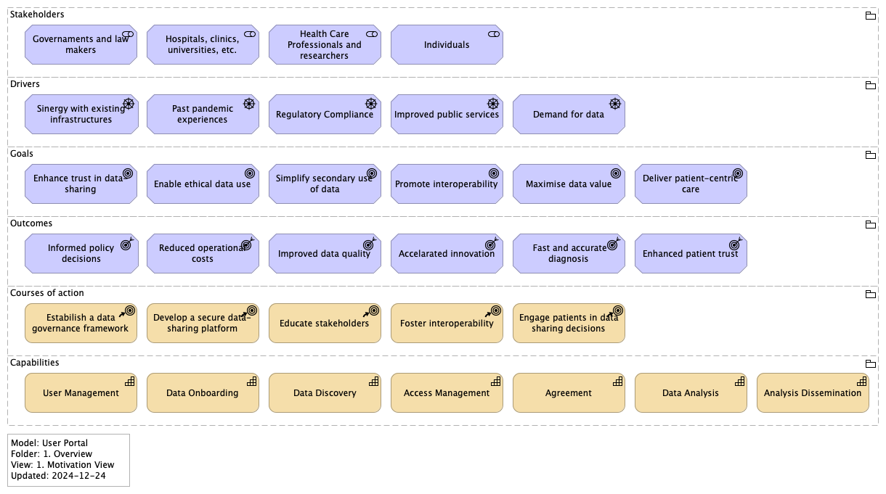
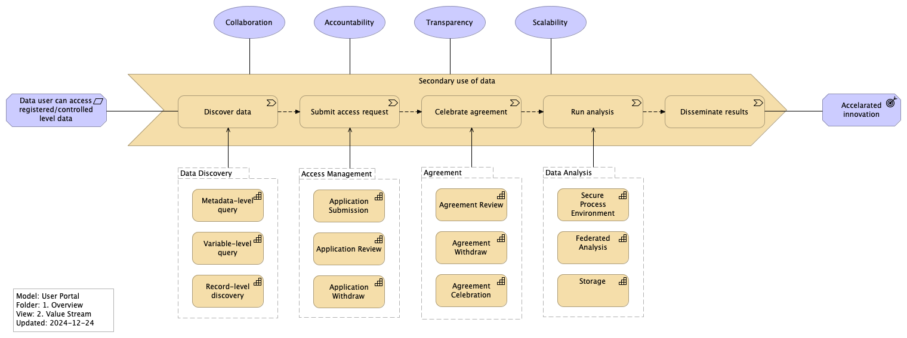
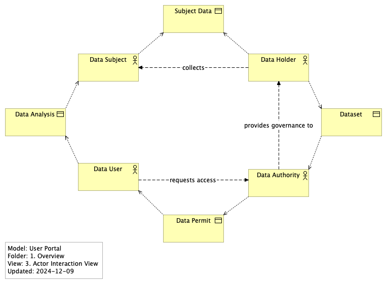
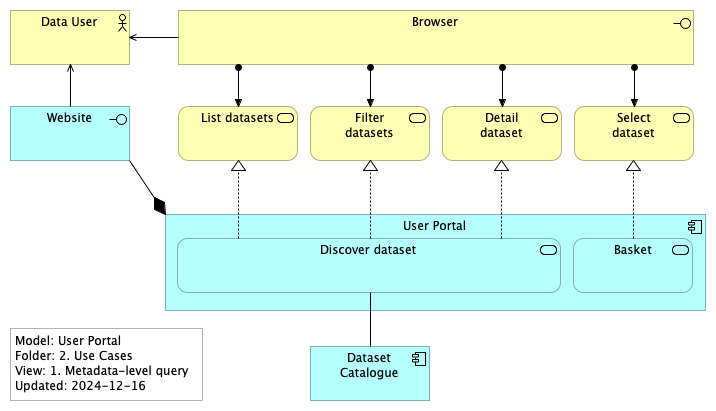
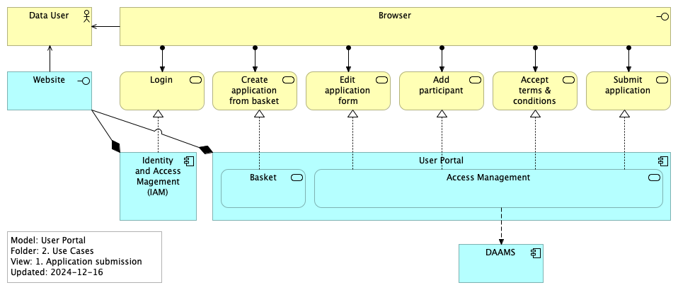
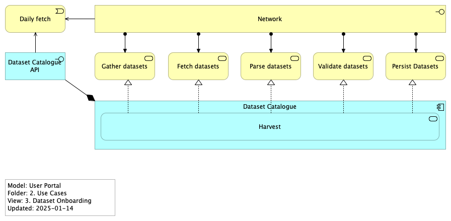
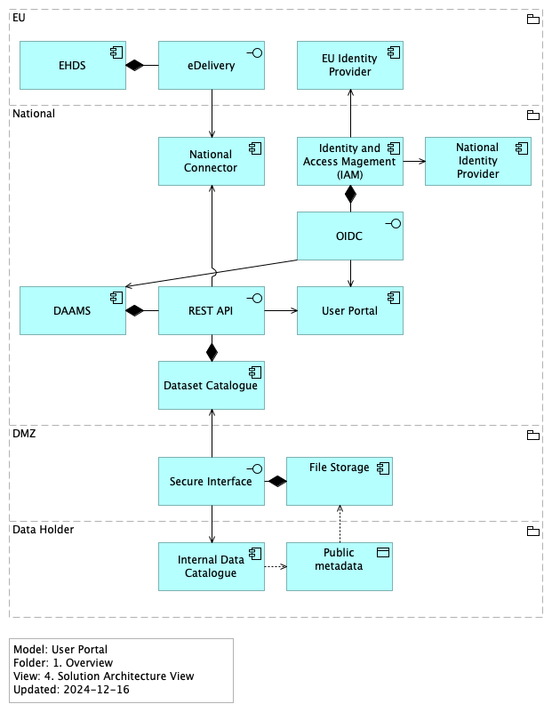
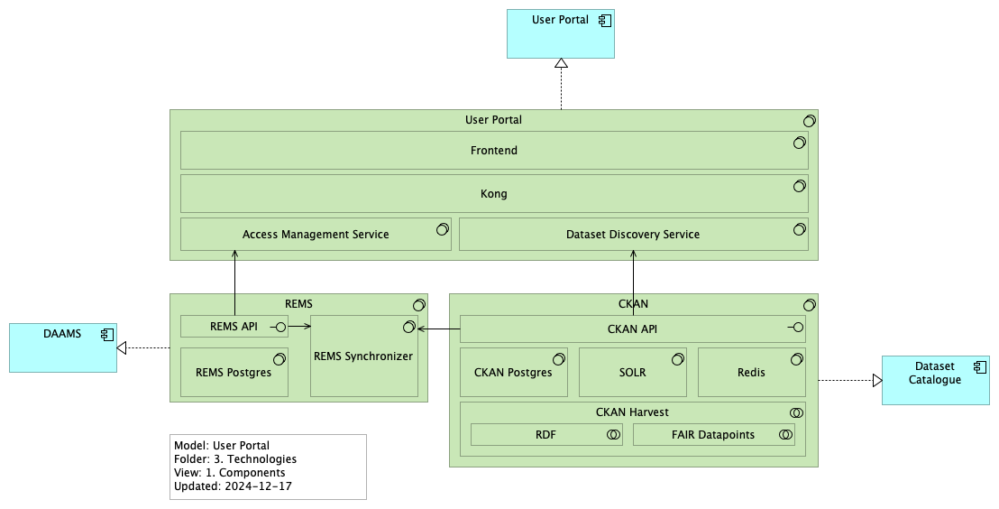

<!--
SPDX-FileCopyrightText: 2024 PNED G.I.E.

SPDX-License-Identifier: CC-BY-4.0
-->

## Executive Summary

The User Portal is designed to facilitate dataset discovery, access request management, and user interactions with a scalable, secure, and user-friendly interface. This architecture emphasizes modularity, leveraging modern technologies and industry standards to deliver a robust solution for managing data catalogs and access requests.

Key objectives include reducing system navigation complexity, centralizing security, and enhancing user experience through observability, scalability, and resiliency. The system adheres to strict privacy and security protocols, ensuring no sensitive user data is stored or cached. Authentication is managed via OpenID Connect (OIDC), and authorization is internally handled by the applications.

## Objectives

## Actors

## Use Cases

## Features

This is a high level list of features, which may change overtime.
* Submit access request applications;
* Store domain event related access request application;
* Notify User about latest changes;
* Listing facets to support dataset discovery in the Portal;
* Querying on datasets;
* Filtering or flagging datasets according to user restrictions;
* Filtering or flagging datasets according to use conditions;

## Architectural Overview

### Solution

### Components

#### Front-end

The front-end of the User Portal. The front-end will be connected to the API Gateway via REST.

#### Kong

The gateway that connects and orchestrates all User Portal microservices. It will expose JSON/REST endpoints, and it will integrate to the other services via JSON/REST as well.

To mitigate integrations issue between the User Portal and other services, it may implement rate limiting, circuit breaker and other mechanisms.

#### REMS

Responsible for:
* Access Request management;

#### CKAN

Responsible for:
* minimum metadata model for User Portal;
* interface manual edition of datasets, if needed;
* harvest national nodes;

#### Access Management Service

It will be an abstraction layer for access request business capabilities. To reduce coupling between User Portal and REMS, it will implement its own API.

#### Dataset Discovery Service

It will be an abstraction layer for dataset discovery business capabilities. To reduce coupling between User Portal and CKAN, it will implement its own api.

### Architectural Styles and Patterns

User Portal has several independent components, each self contained with a single responsibility.  The User Portal will connect and orchestrate them, with minimum invasive implementation on the other components. The User Portal will be divided between front-end and back-end.

The front-end will interface the user and the back-end, providing capabilities according to user roles and access permissions.

On the other hand, the back-end will centralize via REST API some key features (e.g. queries and access requests). The main benefits are:

* Reduced navigation between systems;
* Centralized and standardized security management;
* Observability (logging and monitoring);
* Resiliency (caching, circuit breaking, retries…);

### User Experience

Naturally, one might assume that the data catalog should serve as the front-end of User Portal, given its role in listing all datasets and potentially linking to other components. While this approach is feasible, it introduces the concern of centralizing multiple responsibilities into a single point.

The primary challenge arises from the necessity to develop an extension or fork of the data catalogue for incorporating specific features, such as accessing Beacon and REMS APIs. That demands specialized knowledge and results in a commitment to a vendor-specific solution.

Furthermore, this approach has substantial implications for long-term maintainability. By tightly binding us to a vendor or provider, we would be obligated to adhere to stack-specific, component-specific protocols and component-specific UX constraints. Consequently, this would impose a more prolonged learning curve upon our developers.

A further consequence is the potential creation of bottlenecks, as distinct influxes of requests converge on a single point of failure: the data catalogue. The scalability of the data catalogue at this juncture remains uncertain.

Another vital consideration involves release management, vulnerabilities, and technical debt. Embracing this approach would lead to heightened dependence, which diminishing our ability to promptly address issues and implement new features.

Conversely, opting for an independent user portal empowers us to implement up-to-date integration solutions, optimizing user experience. These solutions encompass REST, observability, scalability, and resiliency. Furthermore, this approach facilitates component replacement with controlled impacts on system usage. Ultimately, it redistributes the workload among all components, effectively mitigating bottlenecks.

### Authentication

It will be achieved through the OIDC protocol, allowing users to login using their host organisations. The confidence that a logged-in user corresponds to the expected person depends on the assurance level of the idP of used to authenticate the current session.

### Authorisation

It is management internally by the applications.

### Security and Privacy

The User Portal must not store, log or cache any user sensitive data. All required data for pre-processing of use conditions must be explicitly requested and proper explanation must given to the user.

The User Portal will implement OIDC standards for user authentication and authorisation. To increase safety, the authorisation code flow is strongly recommend, so access tokens are stored on server-side. 

### Scalability and Performance

All components developed and delivered for User Portal will be containerised.

All REST api's developed for User Portal will be stateless, to support horizontal scalability.

Kong will be deployed to provide observability features, in other to monitor possible bottlenecks and mitigate network issues.

Further evaluation is needed to understand how CKAN can be scaled.

Also further evaluation is needed to understand response time and availability of REMS and Beacon Network, in order to decide if extra resiliency mechanisms are required (e.g. caching, circuit breaking).

Centralised metrics and logs system are strongly recommended to enable fast and effective actions on possible future disruptions.

### Testing and Quality Assurance

Code Review, unit testing and integration tests are strongly recommended and will be encouraged on every development phase. Centralised systems for quality and security checks are strongly recommended, but depend on available computing resources.

### Maintenance and Extensibility

The User Portal has clear goals and well defined components. Metadata discovery and record level metadata discovery follow strict and well known standards: CKAN API, DCAT-AP, Fair Data Point and GA4GH specifications.

On the other hand, Access Request standards are still incipient, and require extra effort from other initiatives, which are out of scope of this project.

A Layered Service Oriented Architecture will play a vital role on isolating different aspect of the system. That will give us freedom to add new features and maintain existing components, reducing coupling between User Portal and external components, like Beacon and REMS.

### Software Stack

### Deployment and Infrastructure

User Portal components will delivered as docker images, to be deployed using docker/podman compose or kubernetes.

### References:
* https://ckan.org/
* https://github.com/CSCfi/rems/
* https://jwt.io/
* https://openid.net/
