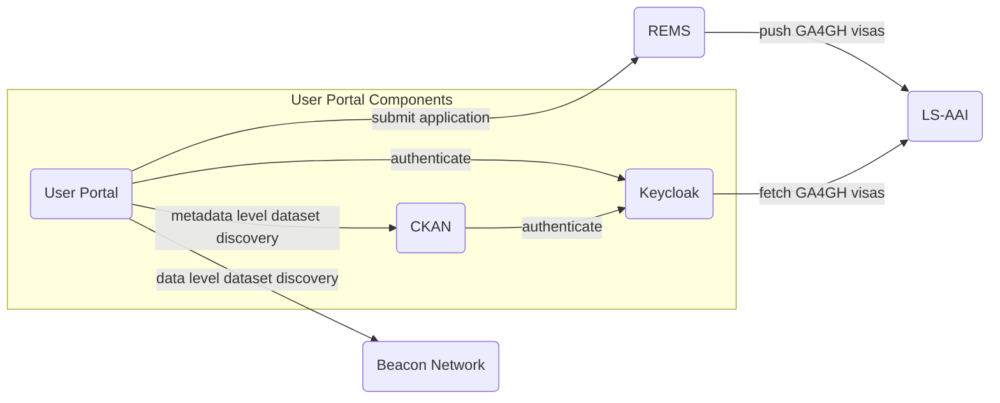
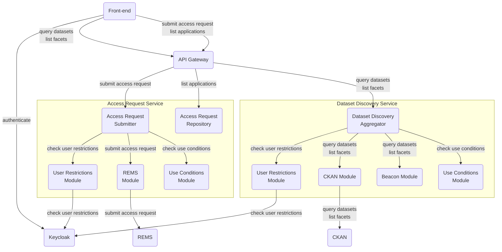
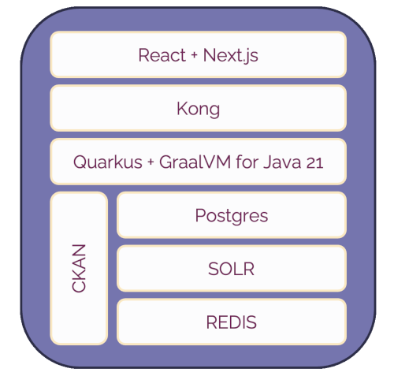

<!--
SPDX-FileCopyrightText: 2024 PNED G.I.E.

SPDX-License-Identifier: CC-BY-4.0
-->

## Executive Summary

The GDI embodies a system of interconnected components, each possessing a specialized function within the broader data management ecosystem. At the core of this architecture is the User Portal - a pivotal junction that orchestrates interactions among the diverse elements. These encompass the Beacon Network, embodying a network of nodes driven by the Beacon API; CKAN, a robust open source data management system; REMS, a resource access rights manager; and AAI, a facilitator of secure data sharing through permissions.

As we navigate the within this architectural landscape, questions arises: should the data catalog take on the role of the GDI's front-end, consolidating a multitude of responsibilities? Should the data catalog understand and comply to GA4GH passport? While plausible, this approach presents some challenges - concentration of functionalities, vendor lock-in, and potential bottlenecks. Such centralized dependency can undermine scalability, flexibility, and maintainability. Conversely, a user portal that stands independently empowers the integration of cutting-edge solutions, uplifting user experience.

## Architectural Overview

### GDI Components

* User Portal is the bridge to all the other components and their key features.
* Beacon Network is a network of Beacons, that implements the Beacon API.
* CKAN is is an open source data management system.
* Resource Entitlement Management System (REMS) is a tool for managing access rights to resources, such as research datasets.
* AAI stands for Authorisation and Authentication Infrastructure. It a group of specifications that enables secure data sharing by communicating the permissions needed to conduct research.
* IDP stands for Identity Provider. We will be using Keycloak, an open Source Identity and Access Management.

## User Portal

### Architectural Styles and Patterns

GDI has several independent components, each self contained with a single responsibility.  The User Portal will connect and orchestrate them, with minimum invasive implementation on the other components. The User Portal will be divided between front-end and back-end.

The front-end will interface the user and the back-end, providing capabilities according to user roles and access permissions.

On the other hand, the back-end will centralize via REST API some key features (e.g. queries and access requests). The main benefits are:

* Reduced navigation between systems;
* Centralized and standardized security management;
* Observability (logging and monitoring);
* Resiliency (caching, circuit breaking, retries…);

### Key Design Decisions

Naturally, one might assume that the data catalog should serve as the front-end of GDI, given its role in listing all datasets and potentially linking to other components. While this approach is feasible, it introduces the concern of centralizing multiple responsibilities into a single point.

The primary challenge arises from the necessity to develop an extension or fork of the data catalogue for incorporating specific features, such as accessing Beacon and REMS APIs. That demands specialized knowledge and results in a commitment to a vendor-specific solution.

Furthermore, this approach has substantial implications for long-term maintainability. By tightly binding us to a vendor or provider, we would be obligated to adhere to stack-specific, component-specific protocols and component-specific UX constraints. Consequently, this would impose a more prolonged learning curve upon our developers.

A further consequence is the potential creation of bottlenecks, as distinct influxes of requests converge on a single point of failure: the data catalogue. The scalability of the data catalogue at this juncture remains uncertain.

Another vital consideration involves release management, vulnerabilities, and technical debt. Embracing this approach would lead to heightened dependence, which diminishing our ability to promptly address issues and implement new features.

Conversely, opting for an independent user portal empowers us to implement up-to-date integration solutions, optimizing user experience. These solutions encompass REST, observability, scalability, and resiliency. Furthermore, this approach facilitates component replacement with controlled impacts on system usage. Ultimately, it redistributes the workload among all components, effectively mitigating bottlenecks.

### Components

#### Front-end

The front-end of the User Portal. The front-end will be connected to the API Gateway via REST.

#### API Gateway

The gateway that connects and orchestrates all GDI components. It will expose JSON/REST endpoints, and it will integrate to the other services via JSON/REST as well.

To mitigate integrations issue between the User Portal and other services, it may implement rate limiting, circuit breaker and other mechanisms.

#### Keycloak

Responsible to connect to IDPs, to authenticate and retrieve authorisation.

##### Authentication

Responsible for validating that a user corresponds to the expected person. This will be achieved through the OIDC protocol, allowing users to login using their host organisations. The confidence that a logged-in user corresponds to the expected person depends on the assurance level of the idP of used to authenticate the current session. The relevant assurance levels are defined in the [eIDAS Regulation](http://eur-lex.europa.eu/legal-content/EN/TXT/?uri=uriserv%3AOJ.L_.2014.257.01.0073.01.ENG).

##### Authorisation

Responsible for validating the different authorization of a logged-in user. This will be achieved by following the GA4GH Passport specification, and sharing passports between components. Upon access to a restricted resource, the passport granting access is validated at the authority granting the authorization, to ensure that the passport has not been revoked during the current session.

#### CKAN

Responsible for:
- minimum metadata model for GDI;
- interface manual edition of datasets, if needed;
- harvest national nodes;

#### Access Request Service

It will be an abstraction layer for access request management. To reduce coupling between User Portal and REMS, it will implement its own API. It will contain two distinct components, Access Request Submitter and Access Request Repository.

Access Request Submitter will be responsible for:
- Identify and implement access request submission depending on the provider (initially it will support REMS);
- Fetch form schema from provider and translate to the User Portal API;
- Check user restrictions before submission;
- Check use conditions before submission;
- Submit access request applications;

Access Request Repository will be responsible for:
- Store domain event related access request application;
- Get and store income event from access request management tools **(REMS should submit events)**;
- Notify User about latest changes;

#### Dataset Discovery Service

It will be an abstraction layer for dataset discovery. To reduce coupling between User Portal and CKAN or Beacon V2, it will implement its own api. It will contain a single component to work as a facade, aggregating and merging different outputs, and filtering or flaging datasets according to user restrictions and use conditions.

It will be responsible for:
- Listing facets to support dataset discovery in the Portal **(Beacon should list facets)**;
- Querying on CKAN;
- Querying on Beacon Network;
- Filtering or flagging datasets according to user restrictions **(User restrictions should come from Keycloak)**;
- Filtering or flagging datasets according to use conditions **(Use conditions should come within Datasets)**;

### Software Stack

### Deployment and Infrastructure

User Portal components will delivered as docker images, to be deployed using docker compose or kubernetes.

### Security and Privacy

The User Portal must not store, log or cache any user sensitive data. All required data for pre-processing of use conditions must be explicitly requested and proper explanation must given to the user.

The User Portal will implement OIDC standards for user authentication and authorisation. To increase safety, the authorisation code flow is strongly recommend, so access tokens are stored on server-side. 

### Scalability and Performance

All components developed and delivered for GDI will be containerised.

All REST api's developed for GDI will be stateless, to support horizontal scalability.

Kong will be deployed to provide observability features, in other to monitor possible bottlenecks and mitigate network issues.

Further evaluation is needed to understand how CKAN can be scaled.

Also further evaluation is needed to understand response time and availability of REMS and Beacon Network, in order to decide if extra resiliency mechanisms are required (e.g. caching, circuit breaking).

Centralised metrics and logs system are strongly recommended to enable fast and effective actions on possible future disruptions.

### Testing and Quality Assurance

Code Review, unit testing and integration tests are strongly recommended and will be encouraged on every development phase. Centralised systems for quality and security checks are strongly recommended, but depend on available computing resources.

### Maintenance and Extensibility

The User Portal has clear goals and well defined components. Metadata discovery and record level metadata discovery follow strict and well known standards: CKAN API, DCAT-AP, Fair Data Point and GA4GH specifications.

On the other hand, Access Request standards are still incipient, and require extra effort from other initiatives, which are out of scope of this project.

A Layered Service Oriented Architecture will play a vital role on isolating different aspect of the system. That will give us freedom to add new features and maintain existing components, reducing coupling between User Portal and external components, like Beacon and REMS.

### References:
* https://www.ga4gh.org/framework/
* https://github.com/ga4gh-beacon
* https://ckan.org/
* https://github.com/CSCfi/rems/
* https://www.ga4gh.org/product/aai/
* https://www.keycloak.org/
* https://jwt.io/
* https://openid.net/
* https://www.youtube.com/watch?v=l5Cu76NQyUY
* https://www.youtube.com/watch?v=K7HID5KAhz0
